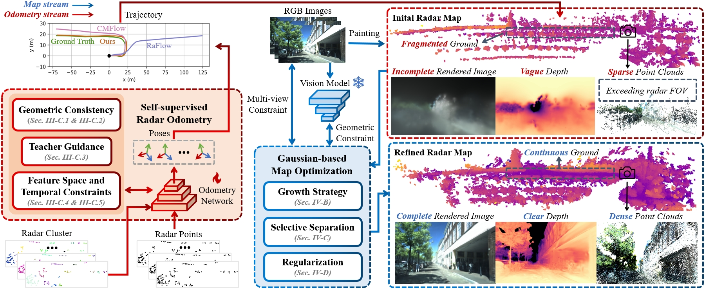
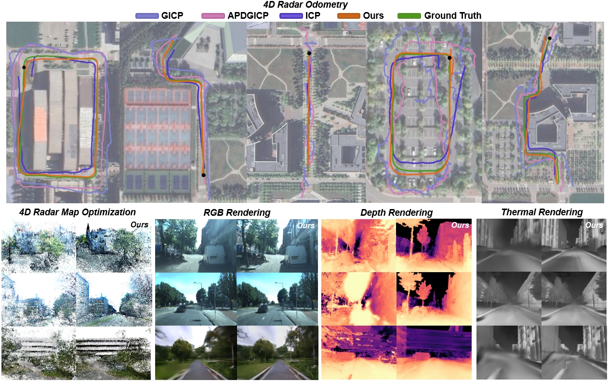

<!-- <h1 align="center"> Super4DR: 4D Radar-centric Self-supervised Odometry and Gaussian-based Map Optimization </h1> -->

    

[2025.11.13] :tada: Our dataset is now open for public access.

[2025.12.11] :confetti_ball: The Super4DR paper has been posted on arXiv.

## Framework Overview

    

In this paper, we propose Super4DR, a radar-centric framework specifically designed for the unique challenges of 4D radar. It comprises a learning-based odometry for pose estimation coupled with a gaussian-based map optimizer to generate dense and complete structure.

## Experiment Results

    

Through experiments with diverse scenes and radar data on public datasets and a self-collected dataset from our multi-sensor handheld platform, we demonstrate Super4DR’s superior performance across multiple tasks.

## Self-collected Campus Dataset

    

**Download link:** [Super4DR-bag](https://pan.baidu.com/s/1e1JB2MattICLVnIKPLxJHg?pwd=jr8s). Code for extracting netdisk data if needed: jr8s

The visualization of our handheld equipment and the projection results among different sensors. Multi-sensor data are collected across various campus scenes under both daytime and nighttime conditions.
